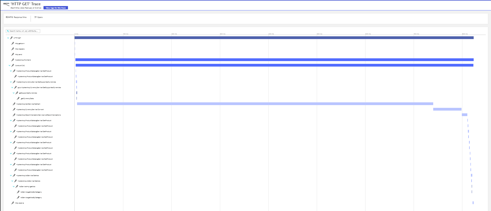
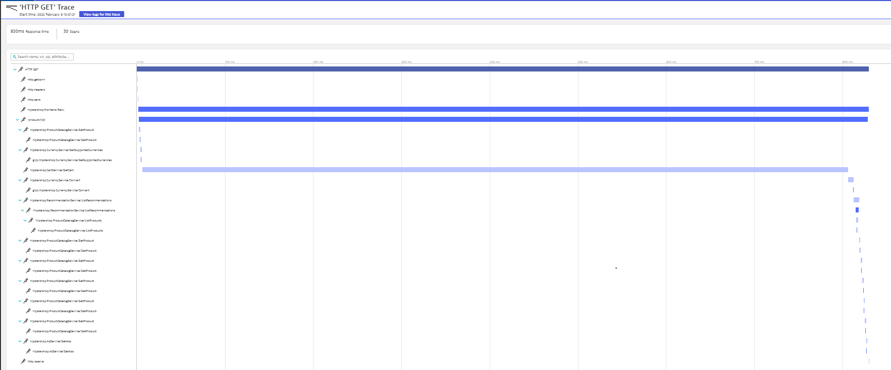

# Is it Observable
<p align="center"></p>

## The OpenTelemetry Operator
<p align="center"></p>

This tutorial will be based on the popular Demo platform provided by Google : The Online Boutique
<p align="center">

</p>

This tutorial will deploy 2 onlinebouque :
* one version fully instrumented with OpenTelemetry
* one version with no openTelemtry instrumentation


## Screenshots

| Home Page                                                                                                         | Checkout Screen                                                                                                    |
| ----------------------------------------------------------------------------------------------------------------- | ------------------------------------------------------------------------------------------------------------------ |
| [](image/online-boutique-frontend-1.png) | [](image/online-boutique-frontend-2.png) |


## Prerequisite
The following tools need to be install on your machine :
- jq
- kubectl
- git
- gcloud ( if you are using GKE)
- Helm

This tutorial will generate traces and send them to Dynatrace.
Therefore you will need a Dynatrace Tenant to be able to follow all the instructions of this tutorial .
If you don't have any dynatrace tenant , then let's start a [trial on Dynatrace](https://www.dynatrace.com/trial/)

## Deployment Steps

You will first need a Kubernetes cluster with 2 Nodes.
You can either deploy on Minikube or K3s or follow the instructions to create GKE cluster:
### 1.Create a Google Cloud Platform Project
```
PROJECT_ID="<your-project-id>"
gcloud services enable container.googleapis.com --project ${PROJECT_ID}
gcloud services enable monitoring.googleapis.com \
    cloudtrace.googleapis.com \
    clouddebugger.googleapis.com \
    cloudprofiler.googleapis.com \
    --project ${PROJECT_ID}
```
### 2.Create a GKE cluster
```
ZONE=us-central1-b
gcloud container clusters create onlineboutique \
--project=${PROJECT_ID} --zone=${ZONE} \
--machine-type=e2-standard-2 --num-nodes=4
```

### 3.Clone the Github Repository
```
git clone https://github.com/isItObservable/OpenTelemetryOperator
cd OpenTelemetryOperator
```
#### 4.Deploy Nginx Ingress Controller
```
kubectl create clusterrolebinding cluster-admin-binding \
  --clusterrole cluster-admin \
  --user $(gcloud config get-value account)
kubectl apply -f nginx/deploy.yaml
```

##### 5. get the ip adress of the ingress gateway
Since we are using Ingress controller to route the traffic , we will need to get the public ip adress of our ingress.
With the public ip , we would be able to update the deployment of the ingress for :
* hipstershop
* grafana
* K6
```
IP=$(kubectl get svc nginx-ingress-nginx-controller -n ingress-nginx -ojson | jq -j '.status.loadBalancer.ingress[].ip')
```

update the following files to update the ingress definitions :
```
sed -i "s,IP_TO_REPLACE,$IP," hipster-shop-otel/k8s-manifest.yaml
sed -i "s,IP_TO_REPLACE,$IP," hipster-shop-nootel/k8s-manifest.yaml
```

#### 4.Prometheus
To generate traffic we are currently using K6 with the integration with Prometheus.
k6 will write load testing statistics in the the Prometheus server.
Therefore we will need to deploy the Prometheus Operator :
```
helm repo add prometheus-community https://prometheus-community.github.io/helm-charts
helm repo update
helm install prometheus prometheus-community/kube-prometheus-stack --set server.nodeSelector.node-type=observability --set prometheusOperator.nodeSelector.selector.node-type=observability  --set prometheus.nodeSelector.selector.node-type=observability --set grafana.nodeSelector.selector.node-type=observability  
```
### 5. Configure Prometheus by enabling the feature remo-writer

To measure the impact of our experiments on use traffic , we will use the load testing tool named K6.
K6 has a Prometheus integration that writes metrics to the Prometheus Server.
This integration requires to enable a feature in Prometheus named: remote-writer

To enable this feature we will need to edit the CRD containing all the settings of promethes: prometehus

To get the Prometheus object named use by prometheus we need to run the following command:
```
kubectl get Prometheus
```
here is the expected output:
```
NAME                                    VERSION   REPLICAS   AGE
prometheus-kube-prometheus-prometheus   v2.32.1   1          22h
```
We will need to add an extra property in the configuration object :
```
enableFeatures:
- remote-write-receiver
```
so to update the object :
```
kubectl edit Prometheus prometheus-kube-prometheus-prometheus
```
After the update your Prometheus object should look  like :
```
apiVersion: monitoring.coreos.com/v1
kind: Prometheus
metadata:
  annotations:
    meta.helm.sh/release-name: prometheus
    meta.helm.sh/release-namespace: default
  generation: 2
  labels:
    app: kube-prometheus-stack-prometheus
    app.kubernetes.io/instance: prometheus
    app.kubernetes.io/managed-by: Helm
    app.kubernetes.io/part-of: kube-prometheus-stack
    app.kubernetes.io/version: 30.0.1
    chart: kube-prometheus-stack-30.0.1
    heritage: Helm
    release: prometheus
  name: prometheus-kube-prometheus-prometheus
  namespace: default
spec:
  alerting:
  alertmanagers:
  - apiVersion: v2
    name: prometheus-kube-prometheus-alertmanager
    namespace: default
    pathPrefix: /
    port: http-web
  enableAdminAPI: false
  enableFeatures:
  - remote-write-receiver
  externalUrl: http://prometheus-kube-prometheus-prometheus.default:9090
  image: quay.io/prometheus/prometheus:v2.32.1
  listenLocal: false
  logFormat: logfmt
  logLevel: info
  paused: false
  podMonitorNamespaceSelector: {}
  podMonitorSelector:
  matchLabels:
  release: prometheus
  portName: http-web
  probeNamespaceSelector: {}
  probeSelector:
  matchLabels:
  release: prometheus
  replicas: 1
  retention: 10d
  routePrefix: /
  ruleNamespaceSelector: {}
  ruleSelector:
  matchLabels:
  release: prometheus
  securityContext:
  fsGroup: 2000
  runAsGroup: 2000
  runAsNonRoot: true
  runAsUser: 1000
  serviceAccountName: prometheus-kube-prometheus-prometheus
  serviceMonitorNamespaceSelector: {}
  serviceMonitorSelector:
  matchLabels:
  release: prometheus
  shards: 1
  version: v2.32.1
```
### 4. Deploy the Opentelemetry Operator

#### Deploy the cert-manager
```
kubectl apply -f https://github.com/jetstack/cert-manager/releases/download/v1.6.1/cert-manager.yaml
```
#### Wait for the service to be ready
```
kubectl get svc -n cert-manager
```
After a few minutes, you should see:
```
NAME                   TYPE        CLUSTER-IP      EXTERNAL-IP   PORT(S)    AGE
cert-manager           ClusterIP   10.99.253.6     <none>        9402/TCP   42h
cert-manager-webhook   ClusterIP   10.99.253.123   <none>        443/TCP    42h
```

#### Deploy the OpenTelemetry Operator
```
kubectl apply -f https://github.com/open-telemetry/opentelemetry-operator/releases/latest/download/opentelemetry-operator.yaml
```

### 6. Configure the OpenTelemetry Collector

#### Requirements
To be able to ingest the Distributed traces generated by our Demo Application  in Dynatrace, it would be requried to modify `openTelemetry-manifest_daemonset.yaml`  with
- your Dynatrace Tenant URL ( your dynatrace url would be `https://<TENANTID>.live.dynatrace.com` )
- A dynatrace API token having the right : `Ingest OpenTelemetry traces`. You can also add `Ingest events`, `Ingest metrics` ,   `Ingest Logs` 
  To generate your API token you will need to click on `Access Tokens` ( in the left menu)
  Follow the instruction described in [dynatrace's documentation](https://www.dynatrace.com/support/help/shortlink/api-authentication#generate-a-token)
  Make sure that the scope Ingest OpenTelemetry traces is enabled.
<p align="center"></p>

#### Udpate the openTelemetry manifest file
```
export DT_TENANT_URL=<YOUR TENANT URL>
export DT_API_TOKEN=<YOUR DYNATRACE API TOKEN>
sed -i "s,TENANTURL_TOREPLACE,$DT_TENANT_URL," kubernetes-manifests/openTelemetry-manifest_daemonset.yaml
sed -i "s,DT_API_TOKEN_TO_REPLACE,$DT_API_TOKEN," kubernetes-manifests/openTelemetry-manifest_daemonset.yaml
```
#### Deploy the OpenTelemetry Collector daemonset
```
kubectl apply -f kubernetes-manifests/openTelemetry-manifest_daemonset.yaml
```

### 7. Deploy the sample applications

#### Deploy hipster-shop with otel
This version of the hipster-shop has the various instrumentation library added in the image of the various services.
All the generated Spans will be exported to the OpenTelemetryCollector deployed with the daemonset mode
```
kubectl create ns hipster-shop-otel
kubectl apply -f kubernetes-manifests/k8s-manifest.yaml -n hipster-shop-otel
```

#### Deploy hipster-shop with no otel , the collector and the Instrumentation
Let's deploy the vanilla version of the hipster-shop ( no instrumentation library deployed in the docker image, except for the services built in GO and C#)
All the services that would be instrumented by the operator will send their spans to a openTelemetryCollector deployed using the sidecar mode.
We will also deploy the 2 instrumentation objects :
- one specific to Python ( python library is currently not supporting the b3 propagator)
- one instrumentation for the Java and nodejs services.

```
kubectl create ns hipster-shop-nonotel
kubectl apply -f kubernetes-manifests/openTelemetry-manifest_sidecar.yaml-n hipster-shop-nonotel
kubectl apply -f hipster-shop-nootel/instrumentation.yaml -n hipster-shop-nonotel
kubectl apply -f hipster-shop-nootel/instrumentation_python.yaml -n hipster-shop-nonotel
kubectl apply -f kubernetes-manifests/k8s-manifest.yaml -n hipster-shop-nonotel
```
### 8. Let's compare the generated traces.

Open Dynatrace, Click on the left menu `Application & Microserivces / Distributed traces`
Look for traces generated for your	http://onlineboutique.<YOUR IP>>.nip.io/  and http://onlineboutique-nootel.<YOUR IP>>.nip.io/
Let's compare 2 generated traces from :
1. without the instrumentation applied by the operator 
<p align="center">

</p>

2. with the instrumentation applied by the operator
<p align="center">

</p>

We can see that we have a bit more spans generated by the manual way of adding the instrumentation.
This is related to the fact that we can  precise the type of instrumentation library we would like to apply.
So we can get more details on the various framework used by our applicaiton.


